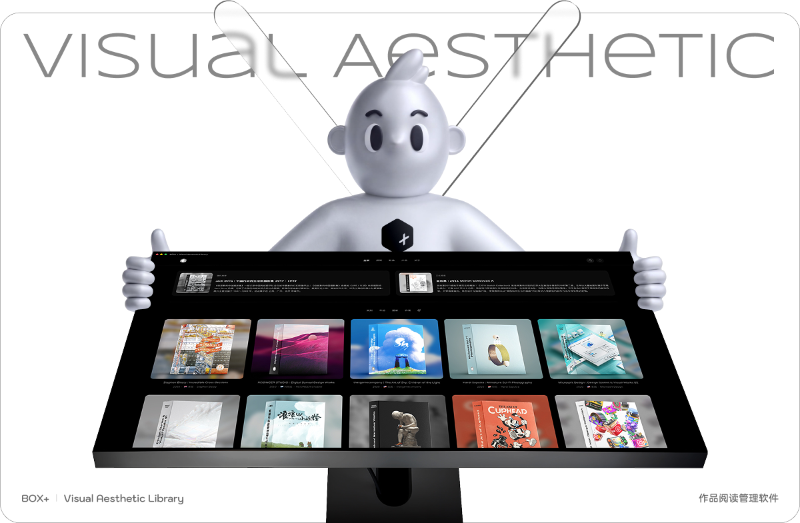
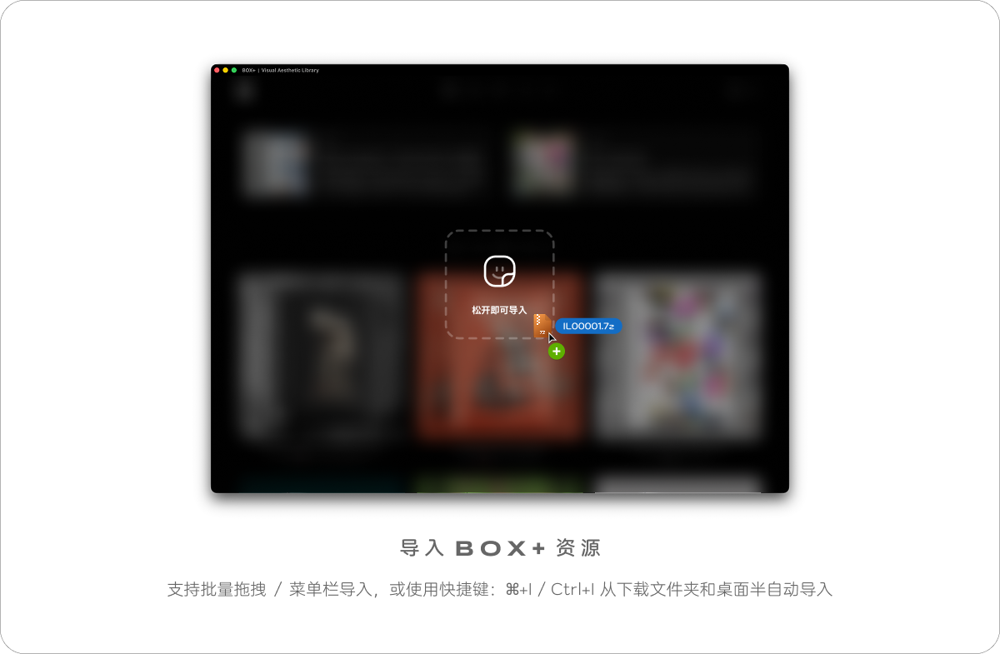
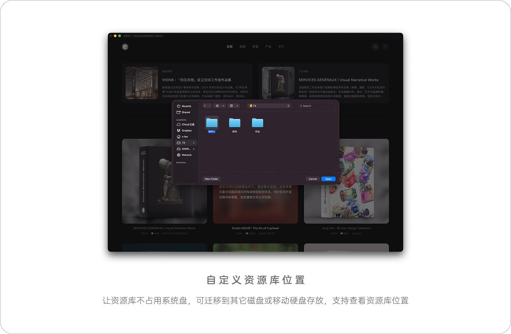
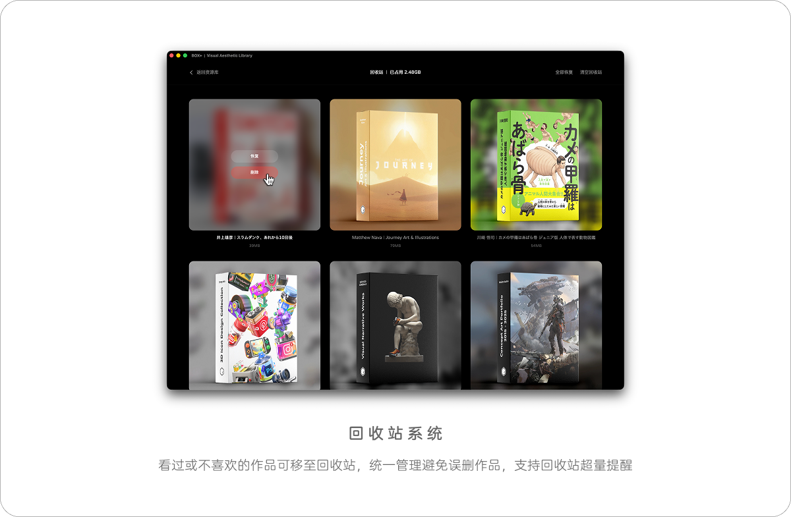

# BOX+ App

**BOX+ 是一款面向视觉创作者的作品阅读与资源库管理工具。**

集中导入、整理、筛选和浏览视觉作品，让灵感资料更清晰、更易查找。

[**下载最新版本**](https://github.com/boxplusworld-boop/BOX-Plus-App-Download/releases/latest)

支持平台：**macOS · Windows**

---

## 视觉作品库

以沉浸式画廊浏览与管理视觉作品，建立属于自己的灵感资料库。

## 快速导入

支持拖放、菜单与快捷键导入 BOX+ 资源，操作简单直接。

## 搜索与筛选

按年份、国家、作者等条件快速定位需要的作品。

## 自定义存储位置

可将资源库存放在其他磁盘或移动硬盘，方便管理空间。

## 回收站管理

不需要的作品可移入回收站，并支持恢复或彻底清理。

---

## 最新版本下载

前往 [GitHub Releases](https://github.com/boxplusworld-boop/BOX-Plus-App-Download/releases/latest) 下载：

- macOS：Apple Silicon / Intel DMG
- Windows：EXE 安装程序
